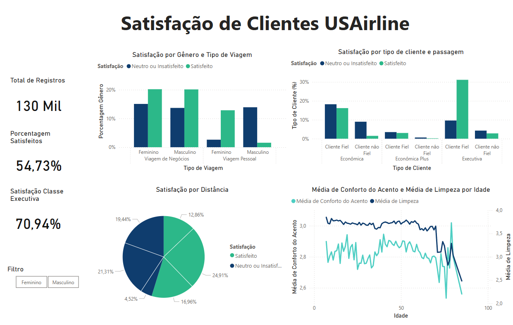

# Análise de Satisfação de Passageiros de Companhias Aéreas

## Descrição
Este projeto utiliza Power BI para criar um dashboard interativo que analisa a satisfação de passageiros de companhias aéreas dos EUA, com base no dataset "US Airline Passenger Satisfaction". O preprocessamento foi feito com SQLite para otimizar os dados.

## Objetivo
Explorar padrões de satisfação dos passageiros por meio de visualizações em diversos gráficos, com foco em fatores como tipo de viagem, classe e gênero, complementado por KPIs de desempenho.

## Fonte de Dados
- **Dataset**: "US Airline Passenger Satisfaction" (Kaggle)  
- **Colunas usadas**: Gênero, Tipo de Viagem, Tipo de Cliente, Classe, Satisfação, Distância de Voo, Idade, Cleanliness, Conforto do Acento 

## Descrição da Utilização do Power BI
O dataset foi reduzido via SQLite (veja `sql_documentation.md`) e carregado no Power BI. As visualizações incluem:  
1. **Barras Agrupadas**: Tipo de Viagem, Satisfação, Gênero  
2. **Barras Agrupadas**: Tipo de cliente, Classe, Satisfação
3. **Pizza**: Distância de Voo (agrupada), Satisfação  
4. **Linha**: Conforto de Acento, Limpeza, Idade

### KPIs Adicionados
- **Todos Registros**: Total de passageiros analisados.  
- **Taxa Geral de Satisfeitos**: Percentual de passageiros satisfeitos.  
- **Satisfação Classe Executiva**: Percentual de satisfeitos na classe Executiva.
- **Filtro de Gênero**: Visualizar as influências dos gêneros nos gráficos e KPIs.

## Captura de Tela

## Conclusão
O projeto revelou insights sobre como tipo de viagem e classe impactam a satisfação, com KPIs oferecendo uma visão geral do desempenho.

---